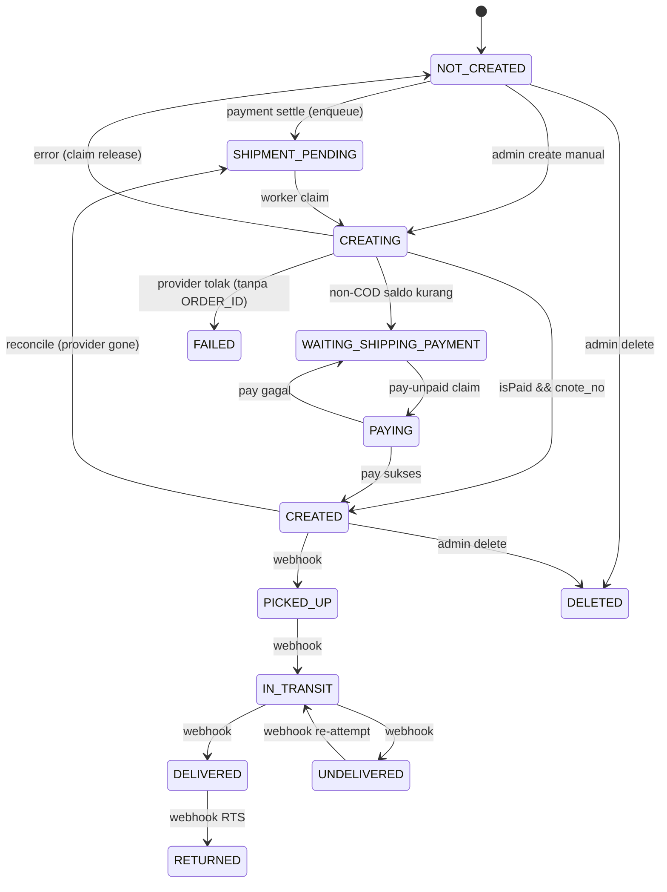

# AUDIT FLOW SHIPPING / FULFILLMENT (RajaOngkir + Mengantar)

> Dokumen ini disusun 100% dari source code aktual repository. Tidak ada kode yang diubah, tidak ada commit, tidak ada migration.
> Semua klaim menyertakan `File / Function / Route / Database / Provider`. Jika tidak ditemukan, ditulis `NOT FOUND`.

---

## A. EXECUTIVE SUMMARY

1. **RajaOngkir dan Mengantar dipakai untuk tujuan BERBEDA.**
   - **RajaOngkir = quotation + address/region source of truth.** Dipakai mengisi dropdown provinsi→kota→kecamatan→kelurahan, resolusi `rajaOngkirDestinationId`, dan **hitung ongkir** saat Mengantar tidak dikonfigurasi.
   - **Mengantar = fulfillment.** Dipakai untuk **estimate primer**, **create shipment** (`POST /order`), **pay ongkir** (`POST /order/pay-unpaid`), **tracking**, dan **reconcile/self-healing**.
   - Sumber: `lib/rajaongkir.ts`, `lib/mengantar/shipping.ts` (komentar "RESPONSIBILITY SPLIT").

2. **Shipping option primer di checkout adalah Mengantar.** Frontend memanggil `POST /api/mengantar/estimate` lebih dulu. **RajaOngkir hanya fallback** ketika Mengantar balas HTTP 503 (belum dikonfigurasi).
   - Sumber: `app/checkout/CheckoutPage.tsx:1365-1500`, `app/buy-now/BuyNowPage.tsx:1897,1953`.

3. **Harga ongkir selalu diverifikasi ulang server-side.** `shipping.cost` dari client **diabaikan**. `createCheckoutOrder()` memanggil `verifyMengantarShippingCost()` (Mengantar) atau `verifyShippingCost()` (RajaOngkir) tergantung `shipping.provider`.
   - Sumber: `lib/checkout.ts:792` (`createCheckoutOrder`), `lib/checkout.ts:83,281` (`verifyShippingCost`).

4. **Tidak ada model `Shipment`.** Shipment direpresentasikan sebagai **field di model `Order`** (`shippingProvider`, `providerShipmentId`, `providerBatchId`, `providerCourier`, `shippingPaymentStatus`, `shipmentStatus`, `trackingNumber`, `codAmount`) + model outbox `ShipmentJob`.
   - Sumber: `prisma/schema.prisma`.

5. **Auto-shipping durable outbox.** Saat pembayaran customer settle (webhook iPaymu/Midtrans, CAS `PENDING|PROCESSING → PAID`), job `ShipmentJob` di-enqueue **di dalam transaksi settlement** (non-COD, `shippingProvider="MENGANTAR"`), lalu `scheduleShipmentProcessing()` memprosesnya via `after()`.
   - Sumber: `app/api/payment/ipaymu/notification/route.ts:448-604`, `app/api/payment/midtrans/notification/route.ts:387-538`.

6. **Dua state machine pembayaran yang terpisah.**
   - `Order.paymentStatus` = pembayaran **customer** ke marketplace.
   - `Order.shippingPaymentStatus` = pembayaran **seller** ke Mengantar (ongkir).
   - Kode berulang kali menegaskan keduanya tidak boleh saling disimpulkan. `shippingPaymentStatus ∈ {UNPAID, PAID, NOT_APPLICABLE}`.

7. **Reconcile/self-healing hanya untuk shipment lokal `CREATED`.** Cron memverifikasi ke provider via `GET /order?order_id=`. Jika provider bilang `isDeleted:true` **atau** lookup authoritative kosong/404 → clear id + reset ke `SHIPMENT_PENDING` + re-queue job. Local `DELETED` (hapus manual admin) adalah **terminal** dan tidak pernah auto-recreate.
   - Sumber: `lib/mengantar/reconcile.ts`.

8. **Hapus shipment oleh admin bersifat lokal.** `deleteMengantarShipmentForOrder()` membersihkan identifier lokal + set `shipmentStatus="DELETED"` + batalkan `ShipmentJob` + audit. **Tidak memanggil DELETE provider.**
   - Sumber: `lib/mengantar/shipment.ts:636+`.

9. **Webhook Mengantar tidak pernah menyentuh `paymentStatus`.** Hanya update `shipmentStatus` lewat decision table + CAS, idempotent & anti out-of-order.
   - Sumber: `app/api/mengantar/webhook/route.ts`, `lib/mengantar/status.ts`.

10. **COD tidak masuk auto-shipping.** Worker membatalkan job COD ("Auto-shipping COD belum diaktifkan"). Reconcile juga mengecualikan COD.

---

## B. ARCHITECTURE DIAGRAM

```mermaid
flowchart TD
    C[Customer] --> M{Pilih Mode}
    M -->|CART| CO[CheckoutPage /api/checkout GET]
    M -->|BUY NOW| BN[BuyNowPage]

    CO --> ADDR[UserAddress]
    BN --> ADDR

    ADDR --> EST{Mengantar configured?}
    EST -->|Ya / 200| ME[POST /api/mengantar/estimate]
    EST -->|503| RO[POST /api/shipping/cost<br/>RajaOngkir fallback]
    BN -->|503| RO2[POST /api/buy-now/shipping<br/>RajaOngkir fallback]

    ME --> OPT[Shipping options<br/>provider=MENGANTAR]
    RO --> OPT2[Shipping options<br/>provider=RAJAONGKIR]

    OPT --> PAY[POST /api/payment/ipaymu<br/>atau /api/orders COD<br/>atau /api/buy-now(/ipaymu)]
    OPT2 --> PAY

    PAY --> CC[createCheckoutOrder modal CART/BUY_NOW]
    CC --> V1{provider?}
    V1 -->|MENGANTAR| VME[verifyMengantarShippingCost]
    V1 -->|RAJAONGKIR| VRO[verifyShippingCost]
    VME --> ORD[(Order PENDING)]
    VRO --> ORD
    ORD --> OI[(OrderItem)]
    ORD --> STK[(ProductVariant stock reserved)]

    ORD --> PG[Payment gateway iPaymu/Midtrans]
    PG --> WH[Webhook notification]
    WH --> CAS[CAS PENDING/PROCESSING -> PAID]
    CAS --> EJ[enqueueShipmentJobTx<br/>MENGANTAR & non-COD]
    EJ --> SW[Worker processShipmentJobs]

    SW -->|stage CREATE| CS[createShipmentForOrder]
    CS --> MA[POST Mengantar /order]
    MA --> ST1{isPaid && cnote_no}
    ST1 -->|true| CREATED[shipmentStatus=CREATED<br/>shippingPaymentStatus=PAID]
    ST1 -->|false non-COD| WAIT[WAITING_SHIPPING_PAYMENT]
    WAIT -->|stage PAY| PU[payUnpaidShipmentForOrder]
    PU --> MP[POST Mengantar /order/pay-unpaid]
    MP --> CREATED

    CREATED --> TRK[Tracking GET /order?tracking_id]
    TRK --> WHK[Mengantar webhook status_category]
    WHK --> SM[shipmentStatus transition]
    SM --> DELIVERED[DELIVERED]
    SM --> RETURNED[RETURNED]
    SM --> CANCELLED[CANCELLED]

    CRON[Cron /api/cron/shipment-reconcile] --> RC[reconcileMengantarShipments]
    RC -->|CREATED + provider gone| RECOVER[reset SHIPMENT_PENDING + re-queue]
    RECOVER --> SW
    ADMIN[Admin DELETE shipment] --> DEL[shipmentStatus=DELETED terminal]
```

---

## C. RAJAONGKIR FLOW

### A. Pemilihan alamat / region

- **Origin (toko):** `StoreSetting.rajaOngkirDestinationId`.
  - Diambil di `createCheckoutOrder()` (`lib/checkout.ts:976-996`) dan `verifyRajaOngkirShippingCostOrThrow()` (`lib/checkout.ts:66-89`).
- **Destination (customer):** `UserAddress.rajaOngkirDestinationId`.
  - Diambil di `createCheckoutOrder()` dan `verifyRajaOngkirShippingCostOrThrow()`.
- **Hierarki wilayah:** `province → city → district → subdistrict` (dropdown).
  - `lib/rajaongkir/locations.ts`: `getProvinces()`, `getCities()`, `getDistricts()`, `getSubdistricts()`.
  - Route: `app/api/rajaongkir/provinces`, `cities`, `districts`, `subdistricts`, `regions`.
- **Mapping ID wilayah (`rajaOngkirDestinationId`):** route `GET /api/rajaongkir/destination`.
  - Memanggil `rajaOngkirFetch("/destination/domestic-destination?search=...&limit=100")`, lalu **exact match** province+city+district+subdistrict (+postal) → ambil `id`.
  - Sumber: `app/api/rajaongkir/destination/route.ts`.
- **Master data lokal:** model `Province`, `Regency`, `District`, `Village`, `RajaOngkirRegion`. Disinkronkan oleh admin via `POST /api/admin/settings/regions/sync` (`rajaOngkirFetch("/destination/domestic-destination")`).

### B. Request ongkir (RajaOngkir)

```text
Frontend (fallback) 
→ POST /api/shipping/cost  atau  POST /api/buy-now/shipping
→ calculateDomesticCost()  (lib/rajaongkir.ts)
→ POST {RAJAONGKIR_BASE_URL}/calculate/domestic-cost
→ normalizeShippingData()
→ response { success, data: ShippingData[], weight }
```

- **Endpoint:** `POST /calculate/domestic-cost` (form-urlencoded).
- **Header:** `key: RAJAONGKIR_API_KEY` (disimpan server, tidak pernah ke browser).
- **Parameter:** `origin` (StoreSetting), `destination` (UserAddress), `weight` (gram, `Math.ceil`), `courier` (allowlist), `price=lowest` (**dipin server-side**, `DEFAULT_PRICE_MODE`).
- **Courier:** `COURIER_ALLOWLIST` (jne, jnt, sicepat, ide, sap, ninja, tiki, lion, anteraja, pos, ncs, rex, rpx, sentral, star, wahana, dse). `sanitizeCouriers()` menolak di luar itu. Default route `/api/shipping/cost`: `jne:jnt:sicepat`.
- **Weight limit:** `MAX_WEIGHT_GRAMS = 30000`.
- **Error handling:** non-JSON → throw; `!response.ok` atau `meta.code >= 400` → throw `meta.message`; route mengembalikan 500 dengan pesan.
- **Retry:** `fetchWithRetry(..., { idempotent: true })` — retry 1× khusus karena pricing POST side-effect free. Timeout per-attempt 8s.
- **Rate limit:** `rateLimiters.shippingCost(getClientIp(request))` → 429.

### C. Pemilihan shipping option (RajaOngkir)

- **Normalisasi:** `normalizeShippingData()` — buang service `JTR*` (cargo), buang cost invalid, filter allowlist, dedupe `courier|service|cost`, sort courier lalu cost termurah.
- **Shape:** `{ courier, courierName, service, description, cost, etd }`.
- **Penyimpanan:** saat order dibuat, **hanya `shippingCourier` + `shippingService`** (dari pilihan client) yang disimpan ke `Order`. `shippingProvider` = `null` (legacy).
  - `lib/checkout.ts:2051-2060, 2074`.
- **Shipping cost** disimpan sebagai `Order.shippingCost` (hasil verifikasi server, bukan input client).
- Jadi RajaOngkir dipakai **menghitung ongkir + menyediakan kode courier/service**, tetapi **tidak membuat shipment/tracking** di flow modern.

---

## D. MENGANTAR FLOW

### A. Area lookup

```text
Checkout
→ buildMengantarShippingOptions()  (server)
→ resolveMengantarDestinationAreaId(address)
→ searchMengantarAreas(keyword)  →  Mengantar GET /address/search?keyword=
→ pickBestArea()  (skor ZIP>subdistrict>district>city>province, min skor 3)
→ cache ke UserAddress.mengantarDestinationAreaId
→ customer memilih opsi kurir
```

- **Kapan dipanggil:** setiap estimate (`POST /api/mengantar/estimate`) dan setiap create shipment (fallback dari field order).
- **Data dikirim:** keyword gabungan `subdistrict district city province postalCode`.
- **Response digunakan:** `_id` (satu-satunya id valid untuk `destination_id`). **BUKAN** `rajaOngkirDestinationId` (id space berbeda).
- **Error:** tidak match → `null` → estimator throw `"Alamat tujuan belum dapat dipetakan ke area Mengantar."`; estimate route 500.
- **Cache invalidation:** `PUT /api/addresses/[id]` men-null `mengantarDestinationAreaId` saat province/city/district/subdistrict/postalCode berubah.
  - Sumber: `lib/mengantar/shipping.ts:184-238`, `app/api/addresses/[id]/route.ts:131-142`.

Origin Mengantar: `StoreSetting.mengantarOriginAreaId` + `mengantarPickupAddressId` (+ `mengantarPickupTimeId` opsional) via `getMengantarOriginConfig()`. Diisi admin lewat `PUT /api/admin/settings` (validasi `resolveMengantarSettingsInput`) dan bisa dideteksi otomatis via `POST /api/admin/settings/mengantar/resolve` (`resolveMengantarStoreConfiguration`).

### B. Shipping estimate

```text
destination (addressId dari client, di-resolve server)
→ buildMengantarShippingOptions()
→ getMengantarOriginConfig()
→ resolveMengantarDestinationAreaId()
→ estimateMengantarShipping({ origin_id, destination_id, weight(kg), courier:"all", COD_AMOUNT? })
→ Mengantar GET /order/estimate
→ entryToOption() per kurir (unsupported di-skip, cost<=0 di-skip)
→ sort by cost
→ checkout
```

- **Berat:** gram → kg (`Math.ceil(grams)/1000`, minimum 1 kg).
- **Response:** satu opsi per kurir (`service="REG"`, display-only), `cost` dari `estimatedPrice ?? price`, `etd` dari `estimatedDate ?? estimate_delivery`, `supportsCod = unsupported_cod === false`.
- **Mengantar vs RajaOngkir: tujuan BERBEDA.** Mengantar = sumber harga + fulfillment (create/tracking). RajaOngkir = fallback quotation when Mengantar tidak dikonfigurasi (`/api/mengantar/estimate` balas 503). Keduanya **tidak** dijalankan bersamaan untuk order yang sama.

---

### Flow Create Shipment Mengantar

Entry points:
- `POST /api/admin/orders/[id]/shipment` → `createShipmentForOrder(orderId, { allowDeleted: true })`.
- Worker otomatis (outbox) → `createShipmentForOrder(orderId)` (**tanpa** `allowDeleted`).
- `POST /api/admin/orders/[id]/shipment/retry` → `runShipmentJobForOrder`.

`createShipmentForOrder()` (`lib/mengantar/shipment.ts:168`):

```text
Order
→ shippingProvider harus "MENGANTAR"
→ guard: status==CANCELLED atau paymentStatus==REFUNDED -> refuse
→ guard: shipmentStatus==DELETED && !allowDeleted -> refuse
→ idempotency: providerShipmentId ada ATAU shipmentStatus in SHIPMENT_ALREADY_CREATED -> kembalikan state
→ toMengantarCourier(providerCourier)
→ getMengantarOriginConfig()
→ resolveMengantarDestinationAreaId(province/city/district/postalCode order)
→ normalizePhone(order.phone) 10-15 digit
→ loadOrderWeight() (OrderItem + ProductVariant.weight)
→ jika COD: estimate ulang untuk cek unsupported / unsupported_cod
→ ATOMIC CLAIM: NOT_CREATED/SHIPMENT_PENDING/FAILED(/DELETED) -> CREATING (stale CREATING > 5 min reclaim)
→ resolveMengantarPickupSchedule()  (scheduledPickup => POST /time; dropOff tanpa call)
→ createMengantarOrder() -> Mengantar POST /order
→ validasi created.ORDER_ID
→ paid = created.isPaid===true && cnote_no
→ shipmentStatus = paid ? CREATED : WAITING_SHIPPING_PAYMENT
→ shippingPaymentStatus = COD ? NOT_APPLICABLE : paid ? PAID : UNPAID
→ CAS finalize (CREATING -> data) ; jika count 0 -> backfill
```

### Pemetaan response provider → database

| Provider field | Disimpan ke | Kapan |
| --- | --- | --- |
| `ORDER_ID` | `Order.providerShipmentId` | Saat create sukses (`finalizeData`) |
| `batch_id` (top-level atau item) | `Order.providerBatchId` | Saat create sukses |
| `cnote_no` | `Order.trackingNumber` | Hanya bila `isPaid && cnote_no`; jika `null` tetap null |
| `isPaid` | tidak disimpan langsung; menentukan `shipmentStatus`/`shippingPaymentStatus` | Saat create |
| `queueStatus` | **TIDAK dipersist** (hanya ada di tipe response) | — |
| `status` / `statusCategory` | tidak dipersist saat create; hanya via webhook | — |
| `isDeleted` / `deletedAt` | **TIDAK dipersist**; dikonsumsi runtime saat reconcile (provider lookup), bukan kolom DB | — |
| `courier` (dikirim) | `Order.providerCourier` | Saat create |

- `providerCourier` di create di-set dari `toMengantarCourier(providerCourier)` (nama kanonik Mengantar, mis. `JNE`, `JT`).
- `Order.shippingCourier` (legacy) di-set saat order creation dari input client (mis. `jne`), tidak diubah shipment flow.
- **`queueStatus`, `isDeleted`, `deletedAt` → NOT FOUND sebagai kolom database.** Nilainya hanya dibaca dari response provider (`MengantarCreateOrderResponse`, `MengantarOrderLookup`).

---

## E. PAYMENT FLOW

### Customer payment (marketplace)

```text
Order (PENDING, paymentStatus PENDING)
→ POST /api/payment/ipaymu  (atau midtrans)
→ createRedirectPayment/createInstruction
→ payment success
→ Webhook → CAS PENDING|PROCESSING -> PAID + paidAt
→ (jika MENGANTAR & non-COD) enqueueShipmentJobTx
→ scheduleShipmentProcessing() setelah response
→ worker -> shipment
```

- **Source of truth settlement:** webhook bertanda tangan. Polling browser & halaman sukses **tidak** menyelesaikan pembayaran.
- **iPaymu:** `POST /api/payment/ipaymu/notification` — verifikasi `X-Signature` (HMAC-SHA256, secret = merchant VA), fail-closed 401. CAS `$executeRaw` hanya dari `PENDING|PROCESSING` dan `paymentStatus NOT IN ('PAID','REFUNDED')`.
- **Midtrans:** `POST /api/payment/midtrans/notification` — `verifySignature` (sha512 `order_id+status_code+gross_amount+ServerKey`).

### Shipping payment (Mengantar)

- **Terpisah total.** `Order.shippingPaymentStatus` (UNPAID/PAID/NOT_APPLICABLE).
- **Kapan dianggap paid:** ketika create Mengantar mengembalikan `isPaid:true` + `cnote_no`, ATAU ketika `payUnpaidShipmentForOrder()` sukses membayar dari saldo Mengantar.
- **Siapa yang mengubah status:** `createShipmentForOrder()` (otomatis), `payUnpaidShipmentForOrder()` (admin route `/shipment/pay` atau worker stage `PAY`). **Tidak ada** webhook Mengantar yang mengubah `shippingPaymentStatus`.
- **Urutan:** shipment **dibuat sebelum** pembayaran ongkir. Jika saldo seller kurang → `shipmentStatus=WAITING_SHIPPING_PAYMENT` (belum ada resi, bukan "shipped"), lalu stage PAY.
- **`shippingPaymentStatus` sengaja TIDAK disentuh oleh `paymentStatus`** (komentar hard rule di `lib/mengantar/shipment.ts`).

---

## F. WEBHOOK FLOW

### 1. Mengantar shipment status

```text
Mengantar
→ POST /api/mengantar/webhook   (public: bypass session, HMAC)
→ verifyMengantarWebhookSignature (x-timestamp + "." + rawBody, HMAC-SHA256, timing-safe, fail-closed)
→ parse { cnote_no, order_id, batch_id, courier, status_category }
→ lookup: providerShipmentId lebih dulu; trackingNumber fallback dengan collision guard
→ decideMengantarShipmentTransition(current, status_category)
→ CAS updateMany (where shipmentStatus == status yang divalidasi)
→ backfill provider id/resi/courier bila kosong
→ onShipmentStatusChanged() (fire-and-forget)
→ NEVER ubah paymentStatus
```

- **Idempotency:** status sama → `no_change`; terminal (`DELIVERED/RETURNED/CANCELLED/DELETED`) ditolak; rank mundur ditolak.
- **Duplicate webhook:** CAS `updateMany` count 0 → balas 200 "Concurrent update already applied".
- **Retry:** 500 agar Mengantar retry; unknown shipment dibalas 200 (stop retry) tanpa efek.
- **Transaction:** update tunggal (bukan multi-step transaction); aman karena CAS.
- **Race:** dijaga CAS + ranking; tidak bisa revive shipment yang sudah `DELETED`.
- **Shipment creation dari webhook:** **TIDAK ADA.** Webhook hanya mengubah status shipment yang sudah ada.

### 2. iPaymu payment
- `app/api/payment/ipaymu/notification/route.ts` — signature `X-Signature`, idempotent CAS, duplicate = no-op, `settled` hanya sekali, enqueue shipment dalam transaksi.
### 3. Midtrans payment
- `app/api/payment/midtrans/notification/route.ts` — `signature_key`, idempotent, enqueue shipment.
### 4. Payout webhook
- `app/api/payment/payout/webhook/route.ts` — settlement komisi affiliate (tidak terkait shipping).

---

### Flow Tracking

```text
Customer/Admin
→ GET /api/orders/[id]/tracking   (user)  /  GET /api/admin/orders/[id]/tracking (admin)
→ baca Order.shippingProvider (routing source of truth)
   ├─ MENGANTAR → getMengantarOrderByTracking(trackingNumber) → GET /order?tracking_id=
   │              → buildMengantarTrackingData() → history → manifest
   │              (gagal → fetched=null, 200 dengan state lokal, TIDAK fallback RajaOngkir)
   └─ lainnya/NULL → RajaOngkir legacy: POST /track/waybill {awb, courier, last_phone_number}
```

- **Sumber status sebenarnya untuk order Mengantar:** `Order.shipmentStatus` (lokal, di-update oleh webhook) + `history[]` provider (real-time poll).
- **Fallback:** tidak ada lintas-provider. Kegagalan Mengantar → tampilkan state DB + pesan `MENGANTAR_TRACKING_MESSAGE`.
- **RajaOngkir tracking** memakai `fetch` langsung (bukan `fetchWithRetry`) di route; rawan hang tanpa timeout (lihat N).
- Tracking number Mengantar = `cnote_no`; query provider memakai `tracking_id`.

---

## G. RECONCILE & RECOVERY FLOW

```text
Cron /api/cron/shipment-reconcile  (atau POST /api/admin/shipments/process)
↓
reconcileMengantarShipments({limit})
↓  kandidat: shippingProvider=MENGANTAR, shipmentStatus=CREATED,
   providerShipmentId != null, trackingNumber != null,
   paymentStatus=PAID, paymentMethod != COD, status != CANCELLED,
   updatedAt < now - 30 menit
↓
verifyMengantarShipment(): GET /order?order_id= (authoritative) → fallback tracking_id
↓
classify: exists | missing | deleted | uncertain
↓
Decision
↓
recoverMengantarShipment(): CAS CREATED -> SHIPMENT_PENDING,
   clear providerShipmentId/providerBatchId/trackingNumber,
   shippingPaymentStatus=null
↓
re-queue ShipmentJob (PENDING/CREATE) atau createMany skipDuplicates
↓
processShipmentJobs() → worker → POST /order (shipment baru)
```

- **Uncertain** (401/403/429/5xx/timeout/network/malformed, atau tracking lookup kosong) → **tidak** reset (fail-safe).
- **Local `DELETED`** → berhenti sebelum provider read (`local_deleted`).

### Skenario wajib

**Scenario 1 — Local `CREATED`, provider `isDeleted=false`**
→ `classifyMengantarLookup` = `exists` → `reconcileMengantarShipment` return `reconciled:false`. Tidak ada perubahan DB.

**Scenario 2 — Local `CREATED`, provider `isDeleted=true`**
→ verdict `deleted` → `recoverMengantarShipment`: CAS reset ke `SHIPMENT_PENDING`, clear provider id/batch/resi, `shippingPaymentStatus=null`, re-queue `ShipmentJob`, tulis `AdminAuditLog` action `MENGANTAR_SHIPMENT_DELETED_EXTERNALLY`. Worker lalu buat shipment baru.

**Scenario 3 — Local `DELETED`, provider `isDeleted=true`**
→ `reconcileMengantarShipment` mendeteksi local `DELETED` → `verdict="local_deleted"`, `reconciled:false`, **tidak ada provider read**. Terminal; tidak dibuat ulang.

**Scenario 4 — Local `DELETED`, provider shipment tidak ditemukan**
→ Sama seperti Scenario 3: local `DELETED` short-circuit. Provider tidak dihubungi.

**Scenario 5 — Provider shipment tidak ditemukan, local `CREATED`**
→ verdict `missing` → recovery yang sama dengan Scenario 2 (clear + `SHIPMENT_PENDING` + re-queue). (Implementasi menyamakan `missing` dan `deleted`.)

**Scenario 6 — Reconcile dijalankan dua kali**
→ Tidak ada recovery job ganda. Alasan:
  1. Kandidat difilter `shipmentStatus="CREATED"`; setelah pass pertama status menjadi `SHIPMENT_PENDING` sehingga tidak lagi masuk kandidat.
  2. Kalaupun balapan, CAS `updateMany(... shipmentStatus:"CREATED" ...)` pada pass kedua count 0.
  3. `ShipmentJob` unik per `orderId` (`@@unique`), re-queue memakai `updateMany`/`createMany skipDuplicates`.

**Scenario 7 — Recovery worker berhasil membuat shipment baru**
Field yang berubah (dari `createShipmentForOrder`):
`providerShipmentId`, `providerBatchId`, `providerCourier`, `trackingNumber`, `shipmentStatus` (`CREATED` atau `WAITING_SHIPPING_PAYMENT`), `shippingPaymentStatus` (`PAID`/`UNPAID`/`NOT_APPLICABLE`), `Order.updatedAt`. `ShipmentJob`: `status=DONE` (atau tetap `PENDING` stage `PAY`), `pickupDate`/`pickupTime`, `lastError=null`.

---

### G.1 ADMIN DELETE SHIPMENT

```text
Admin
→ DELETE /api/admin/orders/[id]/shipment
→ deleteMengantarShipmentForOrder(orderId, adminId)
→ validasi shippingProvider === "MENGANTAR"
→ idempotent bila sudah DELETED & identifier kosong
→ CAS updateMany (pinned exact state): shipmentStatus=DELETED,
   providerShipmentId=null, providerBatchId=null, trackingNumber=null
→ batalkan ShipmentJob (PENDING/FAILED/PROCESSING -> CANCELLED)
→ createAuditLog MENGANTAR_SHIPMENT_DELETED_EXTERNALLY
→ response
```

- **Provider TIDAK dihubungi.** Tidak ada panggilan DELETE ke Mengantar. Provider-side shipment tetap ada.
- `shipmentStatus = "DELETED"` adalah **terminal** untuk:
  - worker: `processClaimedJob` mengecek `DELETED` dan membatalkan job; `createShipmentForOrder` menolak (kecuali `allowDeleted`);
  - reconcile: dikecualikan dari kandidat + short-circuit;
  - webhook: `DELETED` ada di `TERMINAL_SHIPMENT_STATUSES` → event provider tidak bisa menghidupkan kembali.
- **Reconcile tidak boleh membuat shipment baru** setelah admin delete. Satu-satunya jalan recreate adalah admin eksplisit `POST /api/admin/orders/[id]/shipment` (`allowDeleted: true`).
- `Order.paymentStatus`/`status`/`total` **tidak** disentuh (order tetap PAID, tidak dibatalkan).

---

## H. SHIPMENT STATE MACHINE



| State | Trigger | Source | Bisa Recreate? | Terminal? |
| ----- | ------- | ------ | -------------- | --------- |
| `NOT_CREATED` | Order dibuat (MENGANTAR) | `createCheckoutOrder` | Ya | Tidak |
| `SHIPMENT_PENDING` | Payment settle enqueue; reconcile reset | webhook / reconcile | Ya | Tidak |
| `CREATING` | Worker/admin claim | `createShipmentForOrder` | (transient) | Tidak |
| `WAITING_SHIPPING_PAYMENT` | Mengantar `isPaid:false` non-COD | `createShipmentForOrder` | Tidak (sudah dibuat) | Tidak |
| `PAYING` | Claim pay-unpaid | `payUnpaidShipmentForOrder` | (transient) | Tidak |
| `SHIPPING_PAID` | legacy/alias paid | `SHIPMENT_ALREADY_CREATED` set | Tidak | Tidak |
| `CREATED` | `isPaid && cnote_no` / pay sukses | provider response | Tidak (kecuali reconcile saat provider gone) | Tidak |
| `PICKED_UP` | `PICKED UP` | webhook | Tidak | Tidak |
| `IN_TRANSIT` | `ON DELIVERY`/`IN TRANSIT` | webhook | Tidak | Tidak |
| `UNDELIVERED` | `UNDELIVERED` | webhook | Tidak | Tidak |
| `DELIVERED` | `DELIVERED` | webhook | Tidak | **Ya** |
| `RETURNED` | `RTS`/`RETURNED` | webhook | Tidak | **Ya** |
| `CANCELLED` | `CANCELLED`/`CANCELED` | webhook | Tidak | **Ya** |
| `DELETED` | Admin delete | `deleteMengantarShipmentForOrder` | Hanya manual (`allowDeleted`) | **Ya** |
| `FAILED` | Provider tolak (tanpa ORDER_ID) | `createShipmentForOrder` | Ya | Tidak |

---

## I. RAJAONGKIR VS MENGANTAR

| Aspek | RajaOngkir | Mengantar |
| --- | --- | --- |
| Tujuan | Quotation + sumber alamat/region | Fulfillment (estimate, create, pay, tracking, reconcile) |
| Cari ongkir | Ya (`/calculate/domestic-cost`) — **fallback** | Ya (`/order/estimate`) — **primer** |
| Create shipment | **Tidak** | Ya (`POST /order`) |
| Tracking | Ya (`POST /track/waybill`) legacy | Ya (`GET /order?tracking_id=`) |
| Payment | Tidak (hanya quote) | Ya — pembayaran ongkir seller (`/order/pay-unpaid`) |
| Provider ID | `rajaOngkirDestinationId` (wilayah) | `providerShipmentId` (ORDER_ID), `providerBatchId` (batch_id) |
| Tracking number | `Order.trackingNumber` (input manual/import) | `Order.trackingNumber` = `cnote_no` (dari provider) |
| Reconcile | Tidak ada | Ya (`reconcileMengantarShipments`) |
| Recovery | Tidak ada | Ya (reset + re-queue worker) |

**Arsitektur saat ini:** `RajaOngkir = rate/quotation + address` dan `Mengantar = fulfillment`. Namun karena Mengantar bersifat **primer** dan RajaOngkir hanya **fallback saat Mengantar belum dikonfigurasi**, praktiknya: **Mengantar menang bila tersedia; RajaOngkir mengisi kekosongan.**

---

## J. CART VS BUY NOW

| Pertanyaan | Jawaban |
| --- | --- |
| RajaOngkir sama? | Ya — `/api/shipping/cost` (CART) vs `/api/buy-now/shipping` (BUY NOW); keduanya memanggil `calculateDomesticCost` dengan validasi identik. |
| Mengantar sama? | Ya — keduanya memanggil `POST /api/mengantar/estimate` lebih dulu; fallback RajaOngkir saat 503. |
| Pricing shipping sama? | Ya — sama-sama diverifikasi server (`verifyMengantarShippingCost` / `verifyShippingCost`). |
| Order creation sama? | Ya — satu funnel `createCheckoutOrder({ mode })`. CART ambil item dari `Cart` (+ `selectedCartItemIds`); BUY NOW ambil dari `productId/variantId/quantity`. |
| Payment flow sama? | Ya — iPaymu (`/api/payment/ipaymu` CART, `/api/buy-now/ipaymu` BUY NOW). COD: `/api/orders` (CART) dan `/api/buy-now` (BUY NOW). |
| Shipment creation sama? | Ya — tidak ada perbedaan; `shippingProvider`/`providerCourier` disimpan sama pada order. |
| Edge case beda? | Order number prefix beda (`PAY-CART`/`PAY-BN`/`ORD`). Cleanup cart pada settlement hanya untuk `PAY-CART-*`. BUY NOW tidak menyentuh cart. Total weight: CART dari seluruh cart item; BUY NOW dari variant tunggal. Selective checkout hanya di CART. |

---

## K. DATABASE MAPPING

### Order (model kunci)

| Field | Kapan berubah |
| --- | --- |
| `status` | `PENDING` saat create; `PAID` saat webhook settle; `CANCELLED` saat rollback/expire/cancel |
| `paymentStatus` | `PENDING` (non-COD) / `UNPAID` (COD) saat create; `PAID` saat settle; `FAILED` saat rollback; `REFUNDED` saat refund |
| `paidAt` | Saat settle pertama (`IFNULL`) |
| `subtotal` | Dari item (effective price × qty) |
| `shippingCost` | Hasil verifikasi server (bukan client) |
| `total` | `grossAmount = subtotal - discount - spinWheelDiscount + finalShippingCost` |
| `discount` | Voucher + spin wheel |
| `shippingCourier`/`shippingService` | Saat create dari pilihan client (legacy) |
| `shippingProvider` | `MENGANTAR` atau `null` saat create |
| `providerCourier` | Saat create (MENGANTAR) — nama kanonik Mengantar |
| `providerShipmentId` | Saat create sukses (`ORDER_ID`); di-clear saat reconcile reset / admin delete; di-backfill oleh webhook |
| `providerBatchId` | Saat create (`batch_id`); di-clear saat reset/delete |
| `trackingNumber` | Saat create (`cnote_no` bila paid); di-backfill webhook; di-clear reset/delete |
| `shippingPaymentStatus` | `NOT_APPLICABLE` (COD) / `UNPAID` saat create; `PAID` saat paid/pay-unpaid; `null` saat reconcile reset |
| `shipmentStatus` | `NOT_CREATED` create → `SHIPMENT_PENDING`/`CREATING`/`WAITING_SHIPPING_PAYMENT`/`CREATED` → webhook transitions → `DELETED` admin |
| `codAmount` | COD: `grossAmount` saat create |
| `paymentNo/paymentUrl/qrString/...` | Saat instruksi payment dibuat |
| `ttclid/ttp/...` | Saat create (attribution) |

### OrderItem
Dibuat dalam transaksi checkout; `price` = effective marketing price; `subtotal = price × quantity`. `productId`/`variantId` bisa jadi `null` bila produk/variant dihapus (`SetNull`).

### ShipmentJob (outbox, bukan `Shipment`)
`orderId` unik; `status` PENDING/PROCESSING/DONE/FAILED/CANCELLED; `stage` CREATE/PAY; `attempts`/`maxAttempts`; `nextAttemptAt`; `lockedAt`; `pickupDate/pickupTime`; `lastError` (ter-redaksi).

### Address (UserAddress)
| Field | Kapan berubah |
| --- | --- |
| `rajaOngkirDestinationId` | Saat user menyimpan alamat / map wilayah |
| `mengantarDestinationAreaId` | Cache saat resolve; di-null saat field area berubah |
| province/city/district/subdistrict/postalCode | Input user |

### Payment
Instruksi disimpan pada `Order` (`paymentNo`, `paymentUrl`, `qrString`, `paymentChannel`, `paymentExpiresAt`, `paymentReference`). Model `Refund` terpisah untuk refund.

> **`Shipment` model: NOT FOUND.** Digantikan field `Order` + `ShipmentJob`.

---

## L. SOURCE OF TRUTH

| Data | Source of Truth | Local DB | Provider | Catatan |
| --- | --- | --- | --- | --- |
| Order total | Server (`createCheckoutOrder`) | `Order.total` | — | Client tidak dipercaya |
| Shipping cost | Provider (Mengantar/RajaOngkir) re-verify | `Order.shippingCost` | estimate provider | `shipping.cost` client diabaikan |
| Payment status (customer) | Webhook bertanda tangan | `Order.paymentStatus` | iPaymu/Midtrans | CAS + idempotent |
| Shipment status | Provider via webhook; local mirror | `Order.shipmentStatus` | Mengantar `status_category` | ranking/terminal via `status.ts` |
| Tracking number | Mengantar (`cnote_no`) | `Order.trackingNumber` | Mengantar | null selama WAITING_SHIPPING_PAYMENT |
| Provider shipment ID | Mengantar (`ORDER_ID`) | `Order.providerShipmentId` | Mengantar | identifier otoritatif reconcile |
| Shipping payment status | Alur create/pay lokal | `Order.shippingPaymentStatus` | Mengantar balance | tidak ada webhook |
| Delivery status | Mengantar history/manifest | `Order.shipmentStatus` | Mengantar | poll tracking |
| Origin/destination wilayah | RajaOngkir | `StoreSetting`/`UserAddress` | RajaOngkir | —

---

## M. EDGE CASES

Format: Trigger → Current behavior → DB state → Recovery → Risk.

1. **RajaOngkir timeout/error** → `fetchWithRetry` retry 1× (idempotent), lalu throw `UpstreamError`; route 500. DB tidak berubah. Recovery: user ulangi. Risk: rendah.
2. **Mengantar timeout/error (estimate)** → route 502/504 (`isUpstreamTimeout`). DB tidak berubah. Recovery: coba lagi. Risk: rendah.
3. **Mengantar error (create)** → `createShipmentForOrder` melempar; claim dilepas `CREATING → NOT_CREATED`; worker retry dengan backoff. Risk: retry berulang hingga budget habis (`FAILED`).
4. **Payment berhasil tapi shipment gagal** → `ShipmentJob` tetap `PENDING`/`FAILED`; admin `POST .../shipment/retry`. Order tetap PAID. Risk: keterlambatan fulfillment.
5. **Payment webhook duplicate** → CAS `affectedRows=0`, `settled=false`, balas 200 "already processed". Tidak ada enqueue kedua. Risk: rendah.
6. **Shipment create duplicate** → dijaga idempotency set + CAS claim `CREATING` + finalize-miss backfill. Risk: rendah.
7. **Provider delete shipment** → reconcile mendeteksi `isDeleted:true`/missing → reset + re-queue. Risk: hanya untuk `CREATED` (lihat #14).
8. **Provider shipment missing** → sama dengan #7 (missing = recoverable).
9. **Admin delete shipment** → `DELETED` terminal; job dibatalkan; tidak recreate otomatis. Risk: provider-side shipment tetap ada (tidak terhapus).
10. **Order cancelled** → `rollbackCheckoutOrder` CAS `PENDING/PROCESSING → CANCELLED`; shipment guard `status==CANCELLED` menolak create. Risk: rendah.
11. **Order refunded** → `paymentStatus=REFUNDED`; create/worker guard menolak. Risk: rendah.
12. **COD** → `shippingPaymentStatus=NOT_APPLICABLE`; auto-shipping job COD dibatalkan; reconcile mengecualikan COD. Risk: fulfillment COD sepenuhnya manual sampai kontrak diverifikasi.
13. **Shipping payment gagal (saldo kurang)** → `WAITING_SHIPPING_PAYMENT`; worker stage PAY retry backoff; admin `.../pay`. Risk: shipment tertunda, tidak ada resi.
14. **Cron gagal** → route 500 (Mengantar tetap bisa retry via scheduler). Reconcile per-order fault-isolated. Risk: shipment `IN_TRANSIT` yang dihapus provider **tidak** terdeteksi (kandidat hanya `CREATED`).
15. **Worker gagal berkali-kali** → `attempts > maxAttempts` (default 6) → `FAILED`; stale lock 10 menit direclaim. Recovery: admin retry. Risk: perlu intervensi manual.
16. **Retry berkali-kali** → exponential backoff (1 menit → maks 30 menit). Risk: keterlambatan.

---

## N. POTENTIAL PROBLEMS (hanya laporan — tidak diperbaiki)

### CRITICAL
- Tidak ditemukan masalah critical yang terbukti.

### HIGH
1. **Admin delete tidak menghapus shipment di provider.** `deleteMengantarShipmentForOrder` hanya membersihkan DB lokal; provider-side order tetap hidup. Resiko: paket tetap dijemput/dikirim walau admin mengira "sudah dihapus".
   - File: `lib/mengantar/shipment.ts:636+`. **NOT FOUND:** fungsi `deleteMengantarOrder()` / panggilan DELETE ke provider.

2. **Reconcile hanya mencakup `shipmentStatus="CREATED"`.** Shipment `PICKED_UP`/`IN_TRANSIT`/`DELIVERED` yang dihapus di dashboard Mengantar **tidak** akan terdeteksi/self-heal.
   - File: `lib/mengantar/reconcile.ts` (`RECONCILE_ELIGIBLE_STATUS = "CREATED"`).

### MEDIUM
3. **Tracking RajaOngkir memakai `fetch()` mentah** (bukan `fetchWithRetry`) di `/api/orders/[id]/tracking` dan admin tracking → tanpa timeout/retry; request bisa menggantung.
   - File: `app/api/orders/[id]/tracking/route.ts`, `app/api/admin/orders/[id]/tracking/route.ts`.

4. **`getMengantarBalance()` membaca `invoices` untuk saldo** — andai envelope berubah, saldo bisa salah; tidak ditemukan pemakaian langsung di flow otomatis (hanya display).
   - File: `lib/mengantar.ts`.

5. **Rate limiter in-memory** → tidak efektif di multi-instance/serverless (komentar eksplisit di `lib/rate-limit.ts`).

6. **`providerCourier` disimpan kanonik (`JNE`) tetapi `shippingCourier` legacy menyimpan input mentah (`jne`)** — dua representasi courier berbeda dalam satu order; konsumen tracking menormalisasi manual. Risiko inkonsistensi.
   - File: `lib/checkout.ts:2051`, `lib/mengantar/shipment.ts`.

### LOW
7. **`queueStatus`, `isDeleted`, `deletedAt` tidak dipersist** → tidak ada jejak audit provider-side deletion selain `AdminAuditLog` saat reconcile mendeteksi `isDeleted`.
8. **`SHIPPING_PAID` adalah state alias legacy** yang masih diberi rank; jarang/tidak pernah diproduksi oleh flow saat ini.
9. **`codAmount` = `grossAmount` (termasuk ongkir)** — bila ada diskon ongkir setelah perhitungan, nilai COD bisa tidak konsisten dengan ekspektasi provider. Perlu verifikasi kontrak COD (saat ini auto-shipping COD dimatikan).
10. **`cleanupPendingCheckoutOrders` hanya `take:10`** → bila user punya >10 order pending, sebagian tidak dibersihkan pada satu pass.
11. **Webhook Mengantar tidak memvalidasi timestamp freshness** (hanya HMAC). Replay aman secara state, tetapi bukan proteksi replay kriptografis penuh.

---

## O. KESIMPULAN (bahasa sederhana)

- **Alamat/region + harga cadangan = RajaOngkir.** Aplikasi masih memakai RajaOngkir untuk dropdown wilayah dan menyimpan `rajaOngkirDestinationId`; dipakai menghitung ongkir hanya kalau Mengantar belum dikonfigurasi.
- **Pengiriman sebenarnya = Mengantar.** Saat checkout, aplikasi minta daftar kurir + harga ke Mengantar (`/order/estimate`), customer memilih, lalu server memverifikasi ulang harganya saat order dibuat.
- **Order lahir `PENDING`** dengan `shippingProvider="MENGANTAR"` dan `shipmentStatus="NOT_CREATED"`. Setelah customer bayar (webhook iPaymu/Midtrans yang bertanda tangan), order jadi `PAID` dan **secara otomatis** sebuah job pembuatan shipment dimasukkan ke outbox (`ShipmentJob`).
- **Worker** mengambil job itu, memanggil Mengantar `POST /order`. Kalau saldo seller cukup → resi (`cnote_no`) terbit dan status `CREATED`; kalau kurang → status `WAITING_SHIPPING_PAYMENT` menunggu pembayaran ongkir (`/order/pay-unpaid`).
- **Status pengiriman** (picked up, in transit, delivered, returned) datang dari **webhook Mengantar** dan dipetakan ke status lokal lewat tabel tunggal `lib/mengantar/status.ts` (idempotent, tidak bisa mundur, terminal dijaga). Pembayaran customer **tidak pernah** diubah oleh webhook pengiriman.
- **Tracking** dirutekan berdasarkan `shippingProvider`: order Mengantar → Mengantar; order lama → RajaOngkir. Tidak ada fallback silang.
- **Self-healing:** sebuah cron memeriksa order berstatus `CREATED` yang sudah lama; jika Mengantar bilang shipment sudah dihapus (`isDeleted:true`) atau hilang, aplikasi membersihkan identifier lokal, mengembalikan ke `SHIPMENT_PENDING`, dan mengantre shipment baru.
- **Hapus manual oleh admin** = keputusan final: status `DELETED`, cron/worker tidak akan membuat ulang, dan pembayaran order tidak diubah. Ini adalah satu-satunya cara "mematikan" shipment; recreate hanya via aksi admin eksplisit.
- **Dua uang berbeda:** `paymentStatus` (customer→marketplace) dan `shippingPaymentStatus` (seller→Mengantar) adalah dua state machine terpisah yang tidak boleh disimpulkan satu dari yang lain.

---

## Lampiran: SECURITY

| Kontrol | Status | Bukti |
| --- | --- | --- |
| Authentication | Ya | `auth()` di route estimate/checkout/tracking/admin; `proxy.ts` PROTECTED_API_PREFIXES |
| Authorization (owner) | Ya | tracking customer pakai `userId`; estimate cek kepemilikan address |
| Admin authorization | Ya | `session.user.role !== "ADMIN"` di semua route shipment/pay/retry/delete/process & settings |
| Webhook verification | Ya | Mengantar HMAC-SHA256 fail-closed + timing-safe; iPaymu `X-Signature`; Midtrans `signature_key` |
| CRON_SECRET | Ya | `/api/cron/shipment-reconcile` fail-closed 503 bila kosong; constant-time compare |
| Provider secret protection | Ya | API key hanya server (`MENGANTAR_API_KEY`, `RAJAONGKIR_API_KEY`); `redactMengantarKey()`; key di URL path tidak pernah dicetak |
| Input validation | Ya | berat ≤ 30 kg, origin/destination integer, allowlist courier, normalizePhone, id pattern Mengantar |
| Idempotency | Ya | CAS settlement, CAS claim shipment, `ShipmentJob @@unique`, `createMany skipDuplicates` |
| Replay protection | Parsial | Webhook idempotent secara efektif (CAS + ranking status terminal). Mengantar tidak cek freshness timestamp di luar HMAC. iPaymu: replay success = no-op |
| Rate limiting | Ya (terbatas) | `rateLimiters.shippingCost` pada `/api/shipping/cost`, `/api/buy-now/shipping`, `/api/mengantar/estimate`. In-memory per-instance (bukan distributed) |

Catatan: `/api/shipping/` ada di `PUBLIC_API_PREFIXES` (hitung ongkir tanpa login), dilindungi rate limit.
